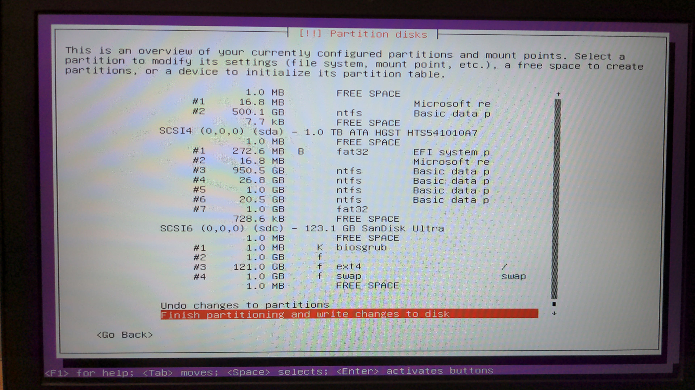

# Metal Machines

Your computer can (temporarily; reversibly; while booted from an external drive or USB stick) be turned into a Linux-native machine, which makes its full resources (RAM; processors) available. This is like a brain transplant for your computer, and is worth doing if you will be spending a lot of time working with the tools

* This will require you to have two USB sticks
   1. A small one to hold the installer software (say, 4GB)
   1. A large one to hold the installed system
      * at least 128 GB
* Be sure to get a _fast_ USB stick, at least for the large drive

n.b.: You will need to reconfigure your machine to permit it to boot from an external drive. This probably will involve disabling a "secure boot" machinery of some kind

   * Instructions for what you need to do for Macs vary by vintage, but at least there's a unique correct answer that depends on your model and is findable via a Google search
   * Instructions for non-Macs (Windows or Linux) machines are much more heterogeneous, but always involve you needing to manipulate your BIOS in several ways
      * On such machines, you can set the boot order between two USB ports
	  * You will need to put your installer USB drive into whichever is the first of these

## Instructions for Installing your VM on a Bootable USB Stick (or drive)

### [Burn](#burn) your chosen ISO image (MIN or MAX) to the small USB stick

 Download your selected [(MIN or MAX)](https://github.com/econ-ark/econ-ark-tools/blob/master/Software/Size.md) ISO [image](https://drive.google.com/drive/folders/1dMVZ7RgDKk8pJIbmshvaKGR64kuVR7FY?usp=sharing) to your computer
0. "mount" the image so that the computer can see it
   * [Create-A-USB-Stick-On-Windows](https://ubuntu.com/tutorials/create-a-usb-stick-on-windows)
   * On Macs, mounting is done with the _Disk Utility_ app ("open image")
   * Next, make a "bootable USB" stick by "flashing" the ISO image to the USB stick
      * ["Carbon Copy Cloner"](https://bombich.com/software/download_ccc.php) is the most reliable option for this
	     * There is a free trial version that should work
	     * Format your USB stick to MS-DOS
		 * Clone from the mounted ISO image to the formatted USB stick
      * ["balenaEtcher"](https://balena.io/etcher/)
	     * Seems to work on 2015-2019 vintage macs
	     * Fails on some earlier and later ones
      * [Create-A-USB-Stick-On-Macs](https://ubuntu.com/tutorials/create-a-usb-stick-on-macos) is another resource

### Boot your computer from the newly created USB stick

1. Macs:
   * Hold the "option" key when the computer is booting
   * Depending on your Mac model, you will see one of
      * "ARKINSTALL"
	  * "EFI BOOT"
   * Pick whichever of these options you see
1. Windows:
   * The steps to boot from an external USB stick depend on your model
       * There are lots of tutorials on the web
	  
### Do Not Destroy Your Real Computer!

The last question the installer will ask is whether you want to write the new partioning schemes to use to format your drive

* It should show your (big) USB stick's (proposed) new partitioning scheme
* Probably it will show only one drive to partition, identified as a flash or USB
  * In that case, just hit return
* If it shows multiple drives to partition (see example below), be careful
  * It may ALSO show your computer's internal drive partitioning scheme
  * This will have a main partition (the largest one), which 
     * will probably be NTFS for a windows machine
	 * will probably be HFS or APFS for a mac
  * You can reassure yourself by checking:
     * Select the partition you are worried about, hit return
     * It should show "do not use this partition" 
	 * If NOT, you can fix by going "Back" in the process

## 
#### Wait, then Wait Again

##### Wait
For some amount of time that depends on the speed of your computer and your internet connection and of your computer, but might be anywhere between 15 min and 1.5 hours, your computer will install the OS on your USB stick.

You can monitor the progress of this by hitting the ALT-FN-4 (alt key and the F4 key).

When that installation has been done, the script attempts to reboot. Your computer might have security settings that prevent a program from rebooting it, in which case you may get an error message, or the machine may just seem frozen. If you are monitoring the progress and the computer seems to be stopped with a last line that says `sudo reboot' or something like that, you are at a point where you can reboot.

BEFORE you reboot, please remove the installer USB stick. (Otherwise, the installer will start over from scratch when you reboot).

If the machine autoreboots on its own, it may (or may not) reboot back into the installer if that is still plugged in. So, if it seems that you've gone back to the very beginning, just shut down the computer, remove ihe installer USB, and reboot to the newly created USB stick.

##### Wait Again

After reboot, the machine will try to install the Econ-ARK set of tools.

Estimated time for the MIN and MAX versions of the installer:

* MIN: Between 45 min and 2h
* MAX: Between 2h and 8h (so, do it overnight)

Your best strategy is probably to install the MIN version, which can be upgraded to the MAX version by changing the name of the file `Size-To-Make-Is-MIN` to `Size-To-Make-Is-MAX` and rerunning the `finish.sh` script; see [here](https:github.com/econ-ark/econ-ark-tools/blob/master/Size.md).

